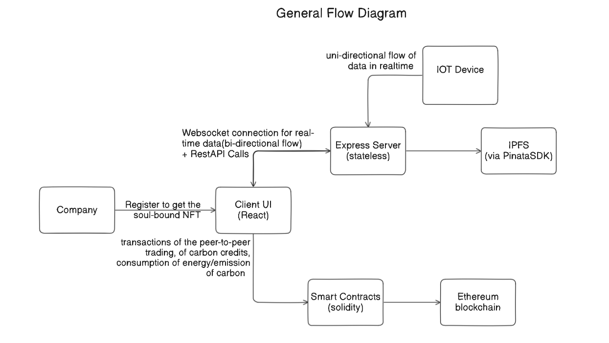
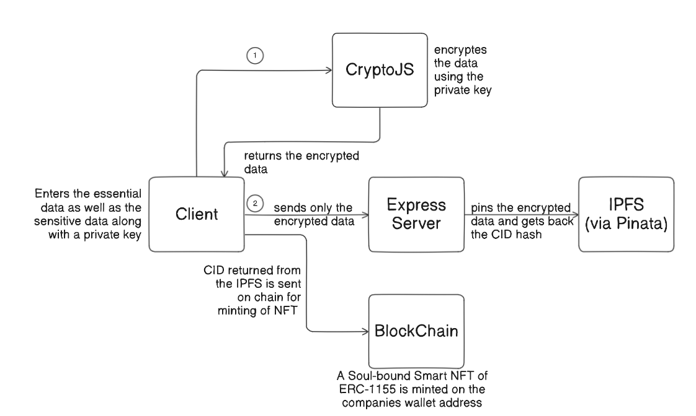
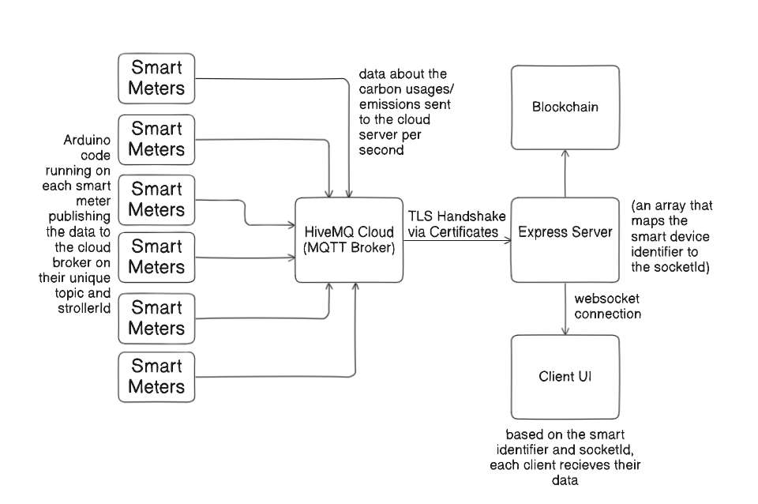

# General Flow of the Platform

# Decentralized Company Registration and Verification Protocol

This report outlines the development and workflow of a decentralized company registration platform that utilizes CryptoJS for encryption, IPFS for decentralized storage, and NFTs for identity verification. The platform ensures secure storage and retrieval of company data while leveraging blockchain technology for transparency and authentication. 

## Workflow of the Platform

### 1. Company Registration Process

When a company registers on the platform, the following steps are followed:

#### 1.1 Data Entry

- The company enters it's general data including sensitive data like production amount , smart meters identifiers and annual power consumption along with a private key that is stored no where.

#### 1.2 Encryption

- The company’s details are encrypted using **CryptoJS** (AES encryption) with the Private key to enhance security.
- This prevents unauthorized access to sensitive information.

#### 1.3 Decentralized Storage (IPFS - InterPlanetary File System)

- The encrypted data is stored on **IPFS**, a decentralized alternative to traditional databases.
- The platform retrieves a unique **CID** (Content Identifier) for the stored data.

#### 1.4 NFT Generation & Metadata Storage

- An ERC-1155 **Smart NFT** (Non-Fungible Token) is minted on the blockchain in the user address. 
- The **NFT metadata** contains the following:
  - Company’s encrypted data hash (**IPFS CID**)
  - Unique NFT ID that is the tokenID.
- The Smart NFT is made non-transferable ensuring it is not mistakenly transfered to someone else.
- **No Sensitive Data** is stored On Chain.

---

### 2. Company Login & Verification

At the time of login, the platform verifies the company’s identity using the NFT metadata.

#### 2.1 Fetching Data from NFT Metadata

- The system retrieves the **IPFS CID** from the NFT metadata.
- It fetches the encrypted company data from **IPFS**.

#### 2.2 Decryption

- The encrypted data is decrypted using the same **CryptoJS AES key** that was used during encryption.

#### 2.3 Authentication

- If the decrypted data matches and is parsed properly, the company successfully logs in.
- If not, access is denied.

---

# IoT-Smart Grid Integration

## Overview

The IoT-Smart Grid integration platform enables secure, transparent, and decentralized monitoring of energy consumption and production in industrial settings. The platform integrates multiple smart devices across industries, collects real-time consumption data, and commits it to an immutable blockchain ledger, ensuring transparency and security.

## System Components and Workflow

1. **Smart Device Setup**
   - Each company can have multiple smart devices installed in their industries.
   - Every smart device has a unique identifier of the format **XXXX_ZZZZ**:
     - **XXXX**: Abbreviation of the company's sector (based on the 52 sectors defined by the EU).
     - **ZZZZ**: A unique numerical identifier for each device.

2. **Data Collection via MQTT Broker**
   - Each smart device sends real-time consumption data (measured every second) to an **MQTT Broker** (HiveMQ).
   - The broker acts as a data stream intermediary between the devices and the server.

3. **Data Transmission and Real-Time Updates**
   - The MQTT Broker streams the consumption data to an **Express server** via a **TLS Certificate** for secure communication.
   - The Express server then emits the consumption/production data along with the device identifier via **WebSockets** to the client-side application in real time.
   - Clients listen to these emitted data streams based on their device identifiers for real-time updates.

4. **Blockchain Commitment**
   - The Express server commits the most recent consumption data to the **blockchain** on a daily basis.
   - This ensures that the data is immutable, auditable, and accessible in a decentralized manner.

5. **Security and Privacy**
   - The identity of the company owning each smart device is not revealed in the data flow pipeline, ensuring enhanced privacy and security.
   - This approach prevents any leakage of proprietary or ownership information.

6. **Transparency and Decentralization**
   - The commitment of daily consumption data to the blockchain ensures complete transparency of the grid’s energy usage.
   - The decentralized nature of the platform ensures that the grid is tamper-proof and auditable by any authorized party.

## Conclusion

This IoT-Smart Grid integration platform provides a secure, transparent, and decentralized solution for monitoring energy consumption in industrial settings. By combining MQTT, WebSockets, and blockchain technology, the platform ensures real-time updates, data immutability, and enhanced security while maintaining privacy for the companies involved.

